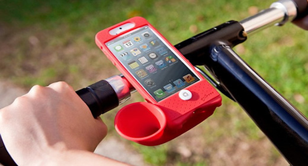

# 一、轮播图实现

  轮播图的应用非常广泛，其实现的原理也比较简单，网络上也有大量关于轮播图实现的方法。这里就具体讲解轮播图的实现方案，代码示例中为部分的代码片段，掌握了基本的实现思路之后可根据实际的需求编写完整代码。示例中图片的宽度为`520px`。


# 二、布局 html

  html部分代码比较简单，整体上可拆分为三部分：图片显示区域、小圆点显区域以及左右按钮区域。当然，我们需要使用一个包装器将其包装起来。结构主要如下：

```html
<div class="wrap">
    <ul class="imgs-box">
        <li></li>

        <li></li>
        <li></li>
        <li></li>
        <li></li>
        <li></li>
        <li></li>

        <li></li>
    </ul>
    <ul class="idots-box">
        <li class="idot-item active"></li>
        <li class="idot-item"></li>
        <li class="idot-item"></li>
        <li class="idot-item"></li>
        <li class="idot-item"></li>
        <li class="idot-item"></li>
    </ul>
    <div class="btns">
        <span class="btn prev"></span>
        <span class="btn next"></span>
    </div>
</div>
```

> tips：
>
> 设置图片的时候，预设图片要比实际图片多两张，即在第一张图片前放置一张最后一张图片，在最后一张图片后放置一张第一张图片，假设你有5张图片，则放置为：`5 1 2 3 4 5 1`，这样做的目的是为了后面做无限滚动使用。

# 三、样式 css

  页面基本布局这里不再细说，主要讲解几个点：

- 容器视图，设置宽高为图片的宽高，并且设置溢出不显示，如果想让容器在水平和垂直方向同时居中，可使用如下css样式设计：

  ```css
  div.wrap {
      position: absolute;
      top: 0; right: 0; bottom: 0; left: 0;
      margin: auto;
  }
  ```


- 在设计 `imgs-box` 的宽度的时候，其值应设为：图片宽度 * 图片张数（包含收尾插入的图片）。并且如果你是使用 `inline-block` 将其子元素横向显示，你还需设置：`font-size: 0;`，这样做的目的是横向显示时，图片盒子能够完全容纳所有图片。
- 图片轮播切换，我们主要是对图片容器（`imgs-box`）使用绝对定位将 `left` 值作为偏移量实现，由于在布局时，真正显示的第一张图片处在第二张的位置，因此在默认状态下，我们需将 `left` 值置为`-图片宽度`，意为将图片图片容器往左偏移一个图片的位置，就刚好显示第二张，即我们正常显示的第一张图片。

# 四、实现 JavaScript

## 1、获取元素

   在JavaScript中你需要通过DOM操作获取图片容器，小圆点集合以及左右按钮元素。我这里是通过*class*来获取，大致如下：

```javascript
var oImgBox = document.getElementsByClassName('imgs-box')[0];
var oPrev   = document.getElementsByClassName('prev')[0];
var oNext   = document.getElementsByClassName('next')[0];
var aIdots  = document.getElementsByClassName('idot-item');
```

## 2、实现左右切换

  我们刚刚已经提到，实现图片切换的原理主要是依据偏移量，即`left`值实现。当点击下一张的时候，只需要在当前偏移量的基础上`+/-`图片宽度即可。

```javascript
/**
 * 事件处理
 */
oPrev.onclick = function() {
	tab(-520);
}
oNext.onclick = function() {
	tab(520);
}


/**
 * 函数定义
 */

function tab(offset) {
	var curLeft = parseInt(getStyle(oImgBox, 'left'));
	oImgBox.style.left = curLeft + offset + 'px';
}

// 获取非行间样式的值
function getStyle(obj, attr) {
	if (obj.currentStyle) {
		return obj.currentStyle[attr];
	}else {
		return getComputedStyle(obj, false)[attr];
	}
}
```

  上述代码中的*getStyle()*函数主要用于获取非行间样式，*tab()*方法封装的是图片的切换，参数为偏移的距离。

## 3、无限滚动

  无限滚动直接根据偏移量（left）的值判断做一个归位的操作。比如显示第一张图片的时候如果点击上一张则设置*left*为最后一张的*left*值，当显示最后一张图片的时候设置*left*为第一张的*left*值。这里直接在*tab()*方法中设置即可。

```javascript
function tab(offset) {
	var curLeft = parseInt(getStyle(oUl, 'left'));
	var tarLeft = curLeft + offset;
	oImgBox.style.left = newLeft + 'px';
	if (tarLeft > -520) {
		oImgBox.style.left = '-3120px';
	}
	if (tarLeft < -3120) {
		oImgBox.style.left = '-520px';
	}
}
```

  在本例中，显示的图片有6张，而在布局时，由于在收尾各插入了一张图片，因此有8张图片，实际显示的第1张的偏移量为`-520`，第2张为`-2 * 520`，第2张为`-3 * 520`…… 以此类推，因此最后一张图片的位置为`-6 * 520` 即`-3120`，

## 4、原点与图片同步

  设置 `curImgIdx` 记录图片当前位置的下标，在点击上一张或下一张图片的时候让 curImgIdx 自增或自减，但要注意边界值的处理。然后根据 curImgIdx 在 `aIdots` 小圆点集合中取到对应小圆点，并为其设置`active`类名即可，我们已经在css中设置了 `.active{} ` 的样式。在此之前我们还需要清除上一次小圆点的样式，即消除上一个小圆点的`active` 类名，这样就避免了所有的小圆点都采用了`.active`样式。

```javascript
// 定义下标
var curImgIdx = 1;
/**
 * 事件添加
 */
oNext.onclick = function() {
	if (curImgIdx == 6) {
		curImgIdx = 1;
	}else {
		curImgIdx++;
	}
	tab(-520);
	changeIdots();
}

oPrev.onclick = function() {
	if (curImgIdx == 1) {
		curImgIdx = 6;
	}else {
		curImgIdx--;
	}
	tab(520);
	changeIdots();
}


/**
 * 修改小圆点
 */
function changeIdots() {
    // 遍历删除`active`类名
    for(var i = 0; i < aIdots.length; i++) {
        // 判断当前的小圆点是否包含类名`active`
        // 如果包含，则直接删除该类名
        if(aIdots[i].classList.contains('active')) {
            aIdots[i].classList.remove('active');
            break;
        }
    }
    // 为对应的小圆点设置'class'为'active'
    aIdots[curImgIdx - 1].classList.add('active');
}
```

## 5、为小圆点添加事件

  遍历小圆点并为其添加点击事件，事件内计算偏移（offset）并调用 *tab()* 方法。*offset* 的计算公式为：`offset = -图片宽度 * (要跳转的位置 - 当前的位置)`。异常处理，如果点击当前所在的小圆点，则直接return，不做任何处理，我们可根据当前小圆点是否包含`active` 类名判断。当然，执行完了以后，我们需要更新当前显示图片的下标。代码如下所示：

```javascript
for(var i = 0; i < aIdots.length; i++) {
    // 为小圆点设置idx属性，记录其位置
    aIdots[i].idx = i + 1;
    aIdots[i].onclick = function () {
        if(this.classList.contains('active')) {
            return;
        }
        //  this -> idot
        //  offset = -520 * (要跳转的位置 - 当前的位置)
        var offset = -520 * (this.idx - curImgIdx);
        // 切换
        tab(offset);
        // 更新
        curImgIdx = this.idx;
        changeIdots();
    }
}
```

## 6、动画实现

  滚动动画的实现比较复杂，这里我们是以关键帧动画的原理来实现，相信大家小时候都玩过小画册，当我们去翻阅画册的时候，画册的内容会动起来，以前的电影播放也是使用的这个原理。如果还是不理解，我们可以以gif图片为例，gif图片的是由多张图片组成，不多的切换图片从而给用户动起来的感觉，在这里，我们把每一张图片叫做一帧。

  要实现关键帧动画，需要搞清楚几个关键的要素，分别是：

- 帧动画持续时间，即 *duration*
- 每一帧执行多长时间（时间间隔），即 *interval*
- 在整个帧动画中，有多少帧，即 *frames = duration / inteval*
- 每一帧移动多少距离，即 *speed = duration / frames*，这里我们需要使用 *Math.ceil()* 将结果向上取整

  清楚了这几个关键要素之后，我们就可以实现动画了，实现帧动画，我们需要借助 *setInterval()* 函数，即定时器函数，该函数每隔一定时间执行一次回调函数，我们通过它，即可根据时间间隔偏移每一帧移动的距离，这样就会在视觉上形成动画效果。

  这里你还需要注意，在回调函数中，我们执行帧动画，要搞清楚，什么时候应该执行动画，什么时候应该结束动画（即清除定时器：*clearInterval()* ）。这里我们需要获取目标值，即你要偏移的位置，当当前的偏移量还没有达到目标值的时候，那么就应该执行帧动画，即逐帧偏移，否则停止动画。而在判断的时候，我们需要从左右两个方向来判断，由于所有的图片的偏移为负数，所以，当切换函数中 `offset` 参数为负数即`offset < 0` 时，为向左移动，显示下一张图片，反之向右移动，显示上一张图片。判断了方向之后，你还需要判断是否达到目标值，对于向左移动时，如果当前偏移量比目标值还要大，说明还没有达到目标值，即应该继续执行逐帧位移，同样的，如果向右移动，如果当前值比目标值还要小，说明还没有达到目标值，也应该继续执行逐帧位移。因此我们可以总结一下，只有满足 *(offset < 0 && curLeft > tarLeft) || (offset > 0 && curLeft < tarLeft)* 时，才应该执行帧动画，否则直接停止动画，清除定时器，具体代码如下：

```javascript
function tab(offset) {
    // 设置帧动画
    // 持续时间
    var duration = 500;
    // 每一帧执行多少时间(时间间隔)
    var interval = 15;
    // 执行多少帧
    var frames = duration / interval;
    // 每一帧移动多少距离
    var speed = Math.ceil(offset / frames);

    // 获取目标值
    var tarLeft = parseInt(getStyle(oImgBox, 'left')) + offset;

    // 设置定时器(每隔一定时间执行一次回调函数)
    var t = setInterval(function () {
        // 获取当前值
        var curLeft = parseInt(getStyle(oImgBox, 'left'));
        // 判断执行动画的条件
        if((offset < 0 && curLeft > tarLeft) || (offset > 0 && curLeft < tarLeft)) {
            oImgBox.style.left = (curLeft + speed) + 'px';
        }else {
            // 动画结束
            // 清除定时器
            clearInterval(t);
            isAnimating = false;
            // 更新当前值
            oImgBox.style.left = tarLeft + 'px';
            // 无限滚动
            var curLeft = parseInt(getStyle(oImgBox, 'left'));
            curLeft = parseInt(getStyle(oImgBox, 'left'));
            if(curLeft < -3120) {
                oImgBox.style.left = '-520px';
            }else if(curLeft > -520) {
                oImgBox.style.left = '-3120px';
            }
        }
    }, interval);
}
```

  当然到了这一步，我们会遇到一个小bug，那就是用户可能不停的点击按钮，并会出现卡顿或者已经停止点击，但位移还在继续的问题，要解决这个问题，我们可以定义一个变量 `isAnimating` 记录动画的状态，如果动画正在执行，那么无论是点击按钮还是点击小圆点，我们应该直接 `return`，终止后续逻辑的执行。而判断动画是否正在执行，我们可以在 *tab()* 函数中处理，一进入*tab()*函数，那么动画肯定是出于执行状态，我们需将 *isAnimating* 的值设为 `true`，在动画停止，即 *else* 中，再将其值设为 `false`。

## 7、自动轮播

  自动轮播比较简单，可以通过定时器实现，只需要在定时器的回调函数中调用点击下一张按钮的事件方法即可。但是需要注意当鼠标经过或移开时需要重启或清除定时器。

```javascript
/**
 * 自动轮播
 */

function play() {
    // 设置自动播放定时器
    timer = setInterval(function () {
        // 执行下一张事件函数
        oNext.onclick();
    }, 3000);
}

function stop() {
    // 清除自动播放定时器
    clearInterval(timer);
}

oWrap.onmouseover = stop;
oWrap.onmouseout  = play;
```

  当然，在执行JavaScript文件时，你需要调用 *play()* 方法，才能自动播放。


